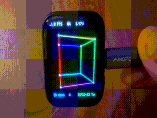

# Ghost Pixel Lab

<p align="center">
  
</p>

Pocket AMOLED playground for the Waveshare ESP32-S3-Touch-AMOLED-1.8: a tiny
app engine (touch launcher, double-buffered DMA renderer, sound mixer with
MP3, storage, Wi-Fi/BLE) plus a growing pile of experiments. Modern C++.

## Hardware

| Part              | Role                                                       |
|-------------------|------------------------------------------------------------|
| ESP32-S3R8        | 240 MHz, 8 MB octal PSRAM, 16 MB flash, Wi-Fi 4 + BLE 5    |
| SH8601            | 1.8" AMOLED, 368 × 448, QSPI                               |
| FT3168            | capacitive touch                                           |
| QMI8658           | 6-axis IMU (gyro + accelerometer)                          |
| ES8311            | mono audio codec + on-board speaker + MEMS microphone      |
| AXP2101           | power management, LiPo charging + battery telemetry        |
| PCF85063          | RTC with backup-battery pads                               |
| TCA9554           | 8-bit I/O expander (drives LCD / TP reset internally)      |

Product page: <https://www.waveshare.com/esp32-s3-touch-amoled-1.8.htm>

## Apps

Boots into a touch launcher; every experiment is one small app class.
Currently on board: **Cube 3D** (IMU wireframe), **Sensor Lab** (hardware
dashboard), **Echo** (mic → speaker), **Piano** (touch synth), **Sand**
(falling sand + tilt), **Maze Ball**, **Level** (spirit level), **Music**
(MP3 from flash & SD), **WiFi Scan**.

Tap to launch — BOOT key or a swipe from the top edge goes back, the PWR key
cycles brightness.

## Build & flash

Requires [PlatformIO](https://platformio.org/).

```sh
pio run -t upload      # build + flash
pio run -t uploadfs    # flash the data/ folder (assets, mp3s)
pio device monitor     # serial @ 115200
```

## Layout

```
src/
  main.cpp      # composition root: board init + app registration
  core/         # engine: App interface, manager, menu, sound mixer
  apps/         # one file pair per experiment
  board/        # hardware modules (display, imu, touch, audio, storage, ...)
data/           # assets packed into LittleFS
docs/           # developer guide
```

## Documentation

How to write an app, the engine APIs, code examples for sound/MP3, sprites,
storage, Wi-Fi/BLE, buttons, configuration and performance — all in the
**[Developer Guide](docs/GUIDE.md)**.

## Status

Sandbox repo. Things change, demos get replaced, APIs are not stable.
