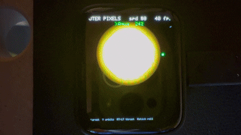
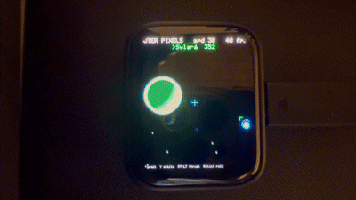
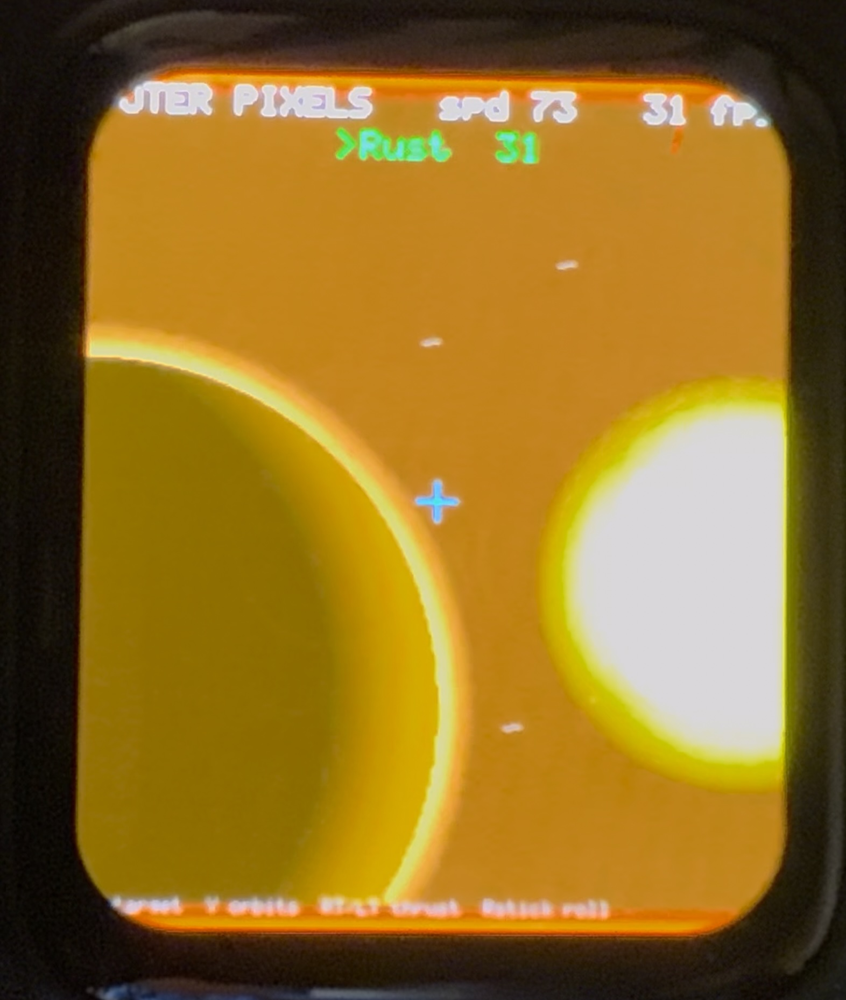
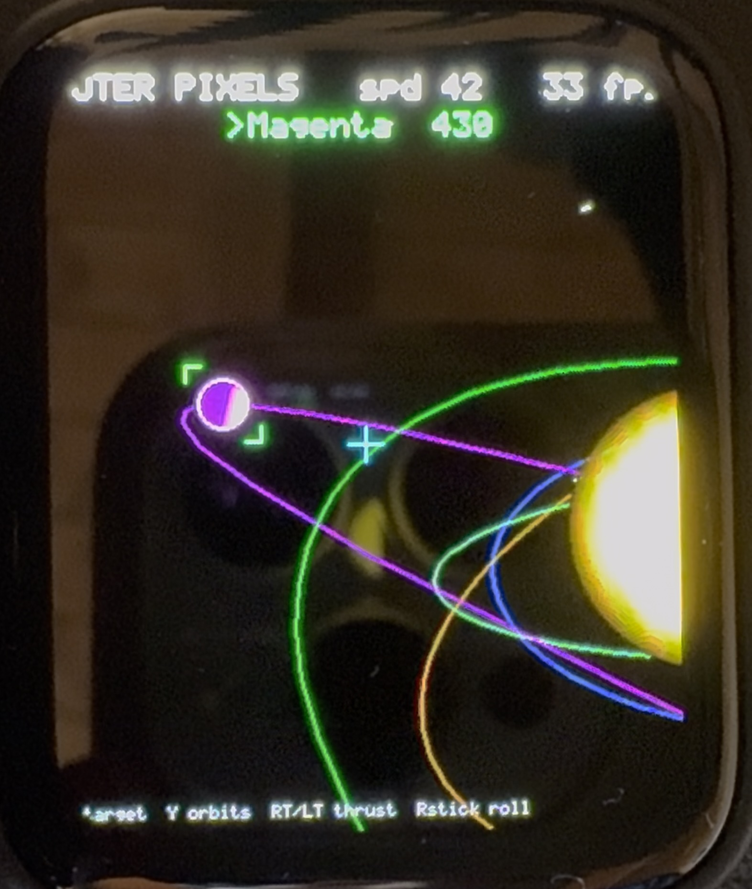

# Ghost Pixel Lab

<div align="center">
  <table>
    <tr>
      <td></td>
      <td></td>
    </tr>
    <tr>
      <td></td>
      <td></td>
    </tr>
  </table>
</div>

<p align="center">
  <a href="https://www.youtube.com/watch?v=ePTqaHAo_ig">▶ Watch on YouTube</a>
</p>

Pocket AMOLED playground for the Waveshare ESP32-S3-Touch-AMOLED-1.8: a tiny
app engine (touch launcher, double-buffered DMA renderer, sound mixer with
MP3, storage, Wi-Fi/BLE) plus a growing pile of experiments. Modern C++.

## Hardware

| Part              | Role                                                       |
|-------------------|------------------------------------------------------------|
| ESP32-S3R8        | 240 MHz, 8 MB octal PSRAM, 16 MB flash, Wi-Fi 4 + BLE 5    |
| SH8601            | 1.8" AMOLED, 368 × 448, QSPI                               |
| FT3168            | capacitive touch                                           |
| QMI8658           | 6-axis IMU (gyro + accelerometer)                          |
| ES8311            | mono audio codec + on-board speaker + MEMS microphone      |
| AXP2101           | power management, LiPo charging + battery telemetry        |
| PCF85063          | RTC with backup-battery pads                               |
| TCA9554           | 8-bit I/O expander (drives LCD / TP reset internally)      |

Product page: <https://www.waveshare.com/esp32-s3-touch-amoled-1.8.htm>

## Apps

Boots into a touch launcher. The first screen holds the two headline apps —
**Ghost BASIC** and **Outer Pixels** — with everything else behind *Others*.

**Ghost BASIC** — a Commodore-64-style computer you program in BASIC.
**Outer Pixels** — Outer-Wilds-style space sim: fly between orbiting planets
and drop onto a voxel surface.

Others: **BLE Scan** (find and pair a Bluetooth keyboard), **Disk** (storage
info + format), **Cube 3D** (IMU wireframe), **Sensor Lab** (hardware
dashboard), **Echo** (mic → speaker), **Piano** (touch synth), **Sand**
(falling sand + tilt), **Maze Ball**, **Level** (spirit level), **Music** (MP3
from flash & SD), **WiFi Scan**, **Pad Lab** (Xbox controller over BLE, incl.
rumble).

Tap to launch — BOOT key or a swipe from the top edge goes back, the PWR key
cycles brightness.

## Ghost BASIC

A Commodore 64 in spirit, not an emulator: a 40 × 25 PETSCII screen with its
own hand-drawn 8 × 8 font, the authentic screen editor (cursor up to an old
line, change it, press RETURN and it is re-entered), and a BASIC V2-flavoured
interpreter down to the original error messages. Type on a Bluetooth-LE
keyboard, or on the USB serial console when none is paired.

Language reference and example programs: **[docs/GHOST_BASIC.md](docs/GHOST_BASIC.md)**.

## Outer Pixels

The headline app: an Outer-Wilds-style space sim (no 3D engine). Fly a 6-DOF
ship between orbiting planets with the Xbox pad; drop low and it switches to a
Comanche-style **voxel terrain** you fly through — procedural, generated in the
background so it's seamless.

## Build & flash

Requires [PlatformIO](https://platformio.org/).

```sh
pio run -t upload      # build + flash
pio run -t uploadfs    # flash the data/ folder (assets, mp3s)
pio device monitor     # serial @ 115200 — doubles as Ghost BASIC's keyboard
./test/c64/run.sh      # run the BASIC interpreter suite on the host
```

## Layout

```
src/
  main.cpp      # composition root: board init + app registration
  core/         # engine: App interface, manager, menu, files, keyboard, sound
  apps/         # one file pair per experiment
    c64/        # Ghost BASIC internals: screen, editor, BASIC, font
  board/        # hardware modules (display, imu, touch, audio, storage, ...)
data/           # assets packed into LittleFS
docs/           # developer guide + Ghost BASIC manual
test/c64/       # host-side interpreter suite (no hardware needed)
```

Files live under `/GHOST` on the SD card, or on internal flash when no card is
present — `core::files` picks one and every app shares the layout:

```
/GHOST/BASIC   BASIC programs (SAVE / LOAD / DIRECTORY)
/GHOST/DATA    app data
/GHOST/SYS     settings, e.g. the paired keyboard
/GHOST/APPS    one folder per app
```

## Documentation

How to write an app, the engine APIs, code examples for sound/MP3, sprites,
storage, Wi-Fi/BLE, buttons, configuration and performance — all in the
**[Developer Guide](docs/GUIDE.md)**.

Programming the machine itself: **[Ghost BASIC manual](docs/GHOST_BASIC.md)**.

## Status

Sandbox repo. Things change, demos get replaced, APIs are not stable.
